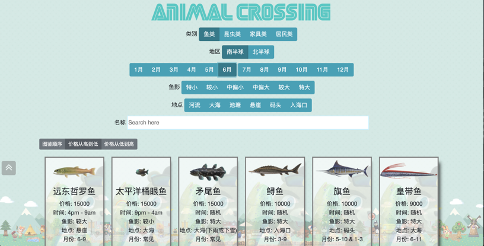
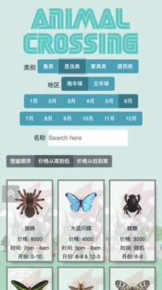
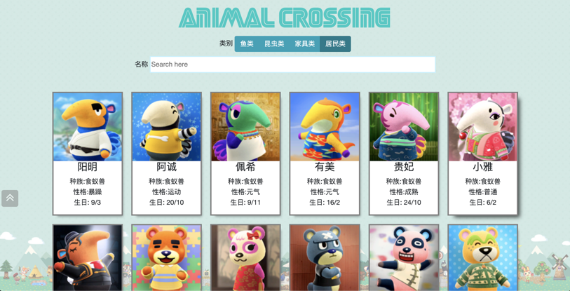

# NS动物森友会简单网页版图鉴
Animal Crossing: New Horizons React APP
A simple website to display, sort and search Animal Crossing fish, bugs, furnitures and villagers information.
Website: https://nsds.info

To run the project:
1. Clone this repo
2. Run `npm install`
3. Run `public/images/download_img.py` to download fish, bugs, furnitures, villagers images
3. Run `npm start`
