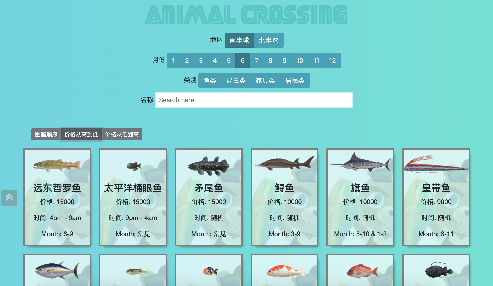
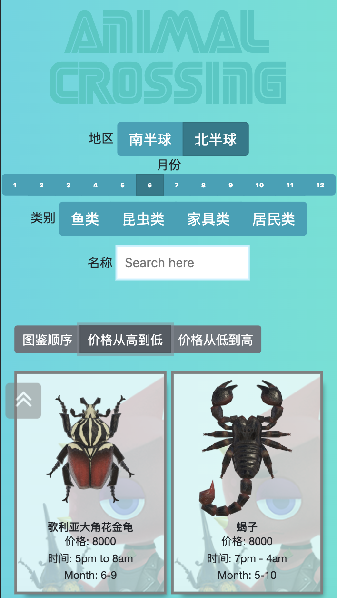

# NS动物森友会简单网页版图鉴
A simple website to display and search Animal Crossing fish, bugs, and villagers information.
Website: https://vcccaat.github.io/AnimalCrossingDB/

To run the project:
1. Clone this repo
2. Run `npm install`
3. Run `npm start`
